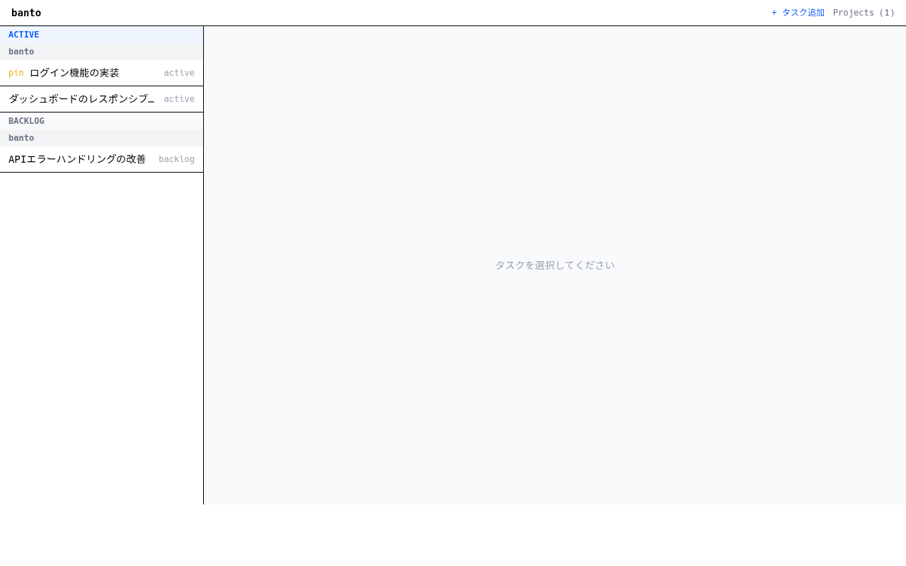

# banto

Coding task dashboard for autonomous agents. Memo what you want to do, throw it at an agent, see results.



## Stack

- **Runtime**: Bun
- **Backend**: Elysia + bun:sqlite
- **Frontend**: React + Tailwind CSS + Eden (type-safe RPC)
- **Agent**: Claude Agent SDK v2

## Setup

```bash
bun install
```

## Development

```bash
bun run dev
```

## Interactive Design Workflow (Pencil)

Use Pencil (`pencil.dev`) to iterate on the dashboard visual direction in a design-native loop.

Prerequisites:

- Pencil desktop app or IDE extension installed
- Claude Code authenticated (`claude`)
- Pencil MCP server visible from your AI assistant (`/mcp`)

Run the prepared redesign flow:

```bash
bun run design:pencil
```

This opens the config at `design/pencil-agent-config.json`, targets `design/banto-dashboard-redesign.pen`, and attaches the current screenshot and redesign brief.

Mock runner mode (no real agent):

```bash
BANTO_MOCK_RUNNER=1 bun run dev
```

## Test

```bash
bun test
bun run test:ime:fast
bun run test:ime:full
```

## Lint / Format / Typecheck

```bash
bun run lint
bun run fmt
bun run typecheck
```
