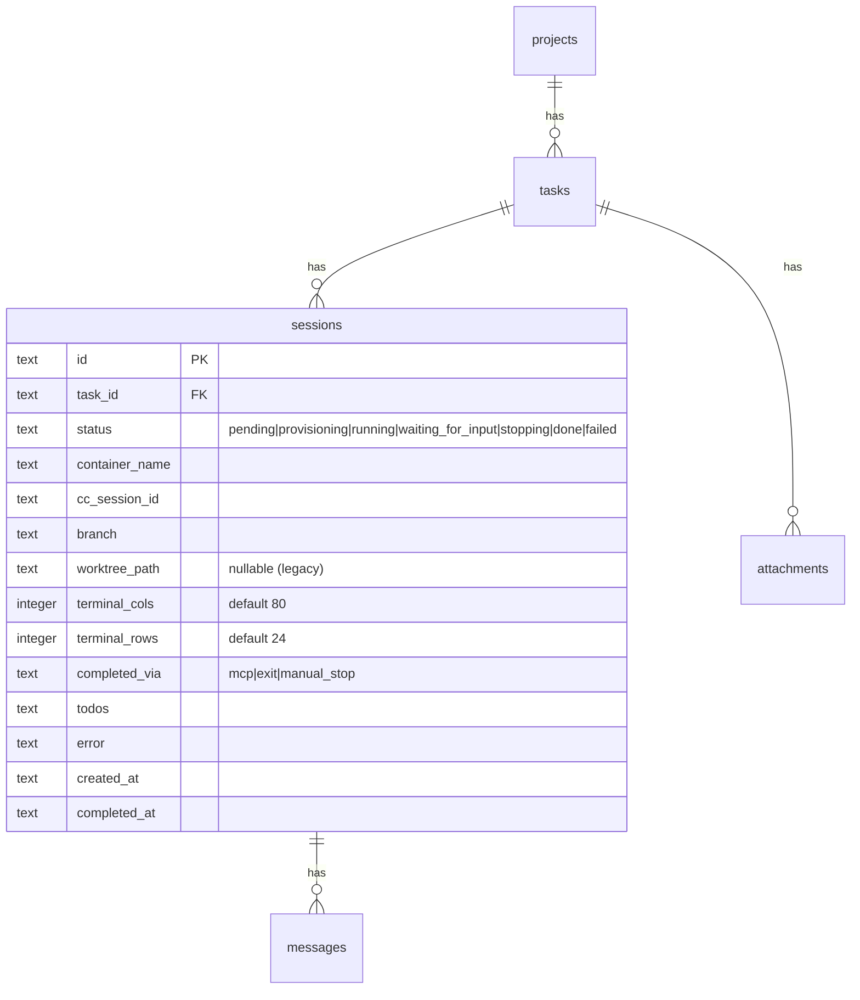

# feat: Claude Code on the Web with NixOS Container Isolation

## Overview

bantoを「タスクを投げて結果を見るバッチダッシュボード」から「WebブラウザでClaude Codeとリアルタイムに対話する開発環境」に進化させる。CC CLIをNixOS Container (systemd-nspawn) 内でPTY経由で実行し、WebSocketでブラウザのxterm.jsに中継する。

配布形態はOSSで、各ユーザーが自分のNixOSマシンにflake importしてセルフホストする。

## Problem Statement / Motivation

現在のbantoは非同期バッチ型（Agent SDK + SSE）。以下の制限がある：

1. **リアルタイム対話不可**: CCの途中介入・方針変更ができない
2. **CC本来のUXが失われる**: ターミナルUI（アニメーション、色、レイアウト）が見えない
3. **隔離が弱い**: git worktreeはファイルシステム分離のみ
4. **環境の再現性**: プロジェクトごとのdevShellを宣言的に管理できない

## Proposed Solution

### Architecture

```
Browser (React + xterm.js)
│
│ WebSocket (binary: PTY data, JSON: control messages)
│
banto server (Elysia on host)
│
│ Bun.Terminal (PTY)
│   └── systemd-nspawn --ephemeral (container)
│         └── claude CLI (interactive mode)
│               ├── /workspace (bind-mounted project code)
│               ├── /nix/store (bind-mounted, read-only)
│               └── MCP: banto-tools (CC subprocess → banto API)
│
│ REST Sidecar (programmatic/headless access)
│   ├── POST /api/sessions/:id/input
│   ├── GET  /api/sessions/:id/output
│   ├── POST /api/sessions/:id/stop
│   └── POST /api/sessions/:id/signal
```

### Key Architectural Decisions

| Decision | Choice | Rationale |
|---|---|---|
| Agent Engine | CC CLI via PTY (replaces Agent SDK) | CCの全機能をそのまま利用。ターミナルUX忠実再現 |
| Isolation | NixOS Container (systemd-nspawn `--ephemeral`) | 軽量起動、Nixストア共有、per-sessionコピーオンライト |
| Terminal | xterm.js v5 (@xterm/xterm) | 10年以上の実績、VS Code採用。ghostty-webは後で移行可 |
| Transport | WebSocket (Elysia `.ws()`) | PTYバイトストリームの双方向中継に必要 |
| Server State | `xterm-headless` + `@xterm/addon-serialize` | カーソル・色・モードまで含む正確な状態復元 |
| Metadata | MCP Server (グローバル設定, CC subprocess) + Stop hook | Agent自身が状態を報告。rootfsに焼き込みで全セッション共通 |
| Auth | Pre-shared token + login page | シングルユーザーOSSに十分。LAN露出を防止 |
| Flow Control | ACK-based backpressure (per-client) | xterm.js処理速度を超えないようPTYをpause/resume |

### PTY vs Agent SDK: 完全移行

Agent SDKは廃止し、PTYに完全移行する。理由：
- Agent SDKとPTYは出力フォーマットが排他的（stream-json vs terminal）
- 構造化メタデータはMCP toolで取得（`banto_complete_session`, `banto_update_status`等）
- Diff: コンテナ外のbind-mountパスで`git diff`実行（コンテナ不要）

---

## Technical Approach

### Session State Machine (Revised)

```
pending ──→ provisioning ──→ running ←──→ waiting_for_input
                │                │                │
                └──→ failed      ├──→ stopping     ├──→ stopping
                                 │      │          │
                                 ├──→ done         ├──→ done (via MCP)
                                 └──→ failed       └──→ failed
```

**変更点（既存からの差分）:**

1. **`waiting_for_input` を維持**: CC CLIのStop hookで検知。hookが `banto_update_status` MCP toolを呼び出して状態を通知。サイドパネルで「入力待ち」バッジ表示に使用
2. **`stopping` を追加**: `POST /sessions/:id/stop` でコンテナ停止中の遷移状態。非同期destroy完了まで他の操作をブロック
3. **MCP vs PTY exit の優先順位**: MCP `banto_complete_session` が先に来た場合は `done` に遷移。PTY exit callbackは `done` 状態なら cleanup のみ実行（idempotent）

**Stop Hook → waiting_for_input の流れ:**

```
CC CLI がターン完了 → Stop hook 発火
  → hook が banto MCP tool を呼び出し: banto_update_status({ status: "waiting_for_input" })
  → banto server が session 状態を waiting_for_input に遷移
  → WebSocket 経由で UI に通知

User がターミナルに入力 → CC CLI が処理開始
  → running に自動復帰（次の PTY output 検知時）
```

**Completion Signal Logic:**

```typescript
// PTY exit handler (src/server/sessions/runner.ts)
function handleSessionEnd(sessionId: string, exitCode: number) {
  const session = sessionRepo.findById(sessionId);
  if (!session) return;

  // MCP already marked done → cleanup only
  if (session.status === "done" || session.status === "failed") {
    cleanupResources(sessionId);
    return;
  }

  // MCP never fired → use exit code
  if (exitCode === 0) {
    sessionService.markDone(sessionId);
  } else {
    sessionService.markFailed(sessionId, `Process exited with code ${exitCode}`);
  }
  cleanupResources(sessionId);
}
```

### WebSocket Protocol

```
Client → Server:
  Binary frame:    キーストローク → PTY stdin
  JSON text frame: { type: "resize", cols: number, rows: number }
  JSON text frame: { type: "ack", clientId: string }

Server → Client:
  Binary frame:    PTY stdout → xterm.write()
  JSON text frame: { type: "status", status: SessionStatus }
  JSON text frame: { type: "exit", code: number }
  JSON text frame: { type: "restore", data: string }
```

フレーム種別判定: バイナリ = PTYデータ、テキスト = JSON制御。`signal` メッセージは不要（Ctrl+CはPTYバイト`\x03`として送信）。

### ACK Flow Control (Per-Client)

```typescript
// Server: per-client ACK tracking
interface ClientState {
  ws: ServerWebSocket;
  pendingAcks: number;
  paused: boolean;
}

const MAX_PENDING_PER_CLIENT = 5;

function onPtyData(session: PtySession, data: Uint8Array) {
  for (const client of session.clients.values()) {
    if (client.paused) continue;
    const result = client.ws.send(data);
    if (result === -1) {
      client.paused = true; // Bun backpressure
      continue;
    }
    client.pendingAcks++;
    if (client.pendingAcks >= MAX_PENDING_PER_CLIENT) {
      client.paused = true;
    }
  }
  // Pause PTY only if ALL clients are paused
  if ([...session.clients.values()].every((c) => c.paused)) {
    session.proc.stdin.pause?.();
  }
}

function onClientAck(session: PtySession, clientId: string) {
  const client = session.clients.get(clientId);
  if (!client) return;
  client.pendingAcks = Math.max(client.pendingAcks - 1, 0);
  if (client.pendingAcks < MAX_PENDING_PER_CLIENT / 2) {
    client.paused = false;
    // Resume PTY if any client is unpaused
    session.proc.stdin.resume?.();
  }
}

// Client disconnect → remove from tracking, resume PTY if needed
function onClientDisconnect(session: PtySession, clientId: string) {
  session.clients.delete(clientId);
  if ([...session.clients.values()].some((c) => !c.paused)) {
    session.proc.stdin.resume?.();
  }
}
```

**Client側 (100KB threshold):**

```typescript
let bytesReceived = 0;
const ACK_THRESHOLD = 100_000;

ws.onmessage = (event) => {
  if (event.data instanceof ArrayBuffer) {
    const chunk = new Uint8Array(event.data);
    bytesReceived += chunk.byteLength;
    if (bytesReceived > ACK_THRESHOLD) {
      terminal.write(chunk, () => {
        ws.send(JSON.stringify({ type: "ack", clientId }));
      });
      bytesReceived = 0;
    } else {
      terminal.write(chunk);
    }
  }
};
```

### Container Strategy

**`--ephemeral` フラグでper-sessionコピーオンライト:**

```typescript
// src/server/sessions/container.ts
function createContainer(config: {
  name: string;
  rootfsPath: string;        // 共有ベースrootfs (nix buildで一度だけ作成)
  workspacePath: string;     // プロジェクトコード (host上)
  secretPath: string;        // API key file (host上)
  sessionId: string;         // BANTO_SESSION_ID 環境変数用
  bantoApiUrl: string;       // MCP bridge が接続する banto server URL
}) {
  return {
    spawn(command: string[], terminalOpts: TerminalOpts) {
      const sanitizedName = config.name.replace(/[^a-zA-Z0-9-]/g, "").slice(0, 64);
      return Bun.spawn([
        "systemd-nspawn",
        "--ephemeral",                                    // CoW overlay, session終了後に自動クリーンアップ
        `--machine=${sanitizedName}`,
        `--directory=${config.rootfsPath}`,
        "--bind-ro=/nix/store",
        `--bind=${config.workspacePath}:/workspace`,
        `--bind-ro=${config.secretPath}:/run/secrets/anthropic_api_key`,
        "--setenv=HOME=/root",
        `--setenv=BANTO_SESSION_ID=${config.sessionId}`,
        `--setenv=BANTO_API_URL=${config.bantoApiUrl}`,
        "--as-pid2", "--quiet",
        // API key injection: read from file inside container
        "/bin/sh", "-c",
        `export ANTHROPIC_API_KEY=$(cat /run/secrets/anthropic_api_key) && exec ${command.join(" ")}`,
      ], { terminal: terminalOpts });
    },
    async destroy() {
      await Bun.spawn(["machinectl", "terminate", config.name.replace(/[^a-zA-Z0-9-]/g, "").slice(0, 64)]).exited;
    },
  };
}

export type ContainerHandle = ReturnType<typeof createContainer>;
```

**NixOS Container Rootfs (flake.nix):**

```nix
nixosConfigurations.banto-container = nixpkgs.lib.nixosSystem {
  system = "x86_64-linux";
  modules = [{
    boot.isContainer = true;
    networking.hostName = "banto-session";
    environment.systemPackages = with pkgs; [
      git ripgrep fd bat
      banto-mcp-bridge  # MCP bridge binary (Nix derivation)
    ];
  }];
};
```

ベースrootfsは一度ビルドして全セッションで共有。`--ephemeral`でセッションごとにtmpfsオーバーレイが作成され、セッション終了時に自動破棄される。

**グローバルCC設定 (rootfsに焼き込み):**

rootfsビルド時に `/root/.claude/settings.json` を含める。全セッション・全プロジェクトで共通:

```json
{
  "hooks": {
    "Stop": [{
      "type": "command",
      "command": "banto-mcp-bridge notify-stop"
    }]
  },
  "mcpServers": {
    "banto": {
      "command": "banto-mcp-bridge",
      "args": ["serve"],
      "env": {}
    }
  }
}
```

`banto-mcp-bridge` は単一バイナリ（Nix derivationとしてビルド）:
- **`serve` モード**: CC subprocessとして起動される MCP server。`BANTO_SESSION_ID` と `BANTO_API_URL` 環境変数でセッション識別。banto server の REST API 経由で `markDone`, `updateStatus`, `createTask` 等を実行
- **`notify-stop` モード**: Stop hook から呼ばれる。同じ環境変数を使い、banto server に `waiting_for_input` 状態を通知

この設計の利点:
- **per-session設定不要**: rootfsに焼き込みなので動的生成が不要
- **マシン全体で有効**: flakeでセットアップすればどのプロジェクトでも自動的に動作
- **Unix socket不要**: MCP bridgeはCCのsubprocessとして起動され、banto serverにはHTTP(S)で接続
- **Phase 0 spike検証項目**: CC hookからMCP toolを直接呼び出せるか（可能であれば `notify-stop` コマンドは不要になり、hookが直接 `banto_update_status` を呼ぶ）

### MCP Server Architecture (Global, Not Per-Session)

**設計原則: rootfsに焼き込み、per-session設定生成は行わない。**

CC CLIが起動すると `/root/.claude/settings.json`（rootfsに含まれる）から `banto` MCP serverを検出し、`banto-mcp-bridge serve` をsubprocessとして起動する。bridge は `BANTO_SESSION_ID` と `BANTO_API_URL` 環境変数（コンテナ起動時に注入）を使ってbanto server のREST APIにリクエストを送る。

```
CC CLI (container内)
  ├── MCP subprocess: banto-mcp-bridge serve
  │     └── HTTP → banto server (host) /api/sessions/:id/mcp/*
  └── Stop hook: banto-mcp-bridge notify-stop
        └── HTTP → banto server (host) /api/sessions/:id/status
```

**Session Start Flow (簡素化):**
1. Container起動: `BANTO_SESSION_ID` と `BANTO_API_URL` を環境変数として注入
2. CLAUDE.md生成: ワークスペースに配置（タスク情報 + MCP tool documentation）
3. CC CLI起動: rootfsの設定からMCP server（banto-mcp-bridge）を自動検出・起動
4. Stop hook: CC CLIが設定から自動登録

**Session End Flow:**
1. PTY exit / MCP completion signal
2. CC CLIがbanto-mcp-bridge subprocessを自動終了
3. Container destroy（--ephemeral で overlay自動クリーンアップ）

**banto-mcp-bridge (Nix derivation):**

```typescript
// packages/banto-mcp-bridge/src/serve.ts
// CC subprocess として起動。stdin/stdout で MCP protocol を話す。
// banto server への通信は HTTP。

const sessionId = process.env.BANTO_SESSION_ID;
const apiUrl = process.env.BANTO_API_URL;  // e.g. "http://10.0.0.1:3000"
const token = process.env.BANTO_TOKEN;

const server = new Server({ name: "banto-tools", version: "1.0.0" }, { capabilities: { tools: {} } });

server.setRequestHandler(CallToolRequestSchema, async (request) => {
  const { name, arguments: args } = request.params;
  // banto server にHTTPで中継
  const res = await fetch(`${apiUrl}/api/sessions/${sessionId}/mcp/${name}`, {
    method: "POST",
    headers: { "Authorization": `Bearer ${token}`, "Content-Type": "application/json" },
    body: JSON.stringify(args),
  });
  const result = await res.json();
  return { content: [{ type: "text", text: JSON.stringify(result) }] };
});

const transport = new StdioServerTransport();
await server.connect(transport);
```

```typescript
// packages/banto-mcp-bridge/src/notify-stop.ts
// Stop hook から呼ばれる。waiting_for_input を通知。

const sessionId = process.env.BANTO_SESSION_ID;
const apiUrl = process.env.BANTO_API_URL;
const token = process.env.BANTO_TOKEN;

await fetch(`${apiUrl}/api/sessions/${sessionId}/status`, {
  method: "POST",
  headers: { "Authorization": `Bearer ${token}`, "Content-Type": "application/json" },
  body: JSON.stringify({ status: "waiting_for_input" }),
});
```

**banto server側のMCPエンドポイント (routes.ts追加):**

```typescript
// POST /sessions/:id/mcp/:toolName — MCP bridge からの中継
.post("/sessions/:id/mcp/:toolName", ({ params, body }) => {
  switch (params.toolName) {
    case "banto_complete_session":
      sessionService.markDone(params.id);
      return { ok: true };
    case "banto_update_status":
      messageRepo.insert({ sessionId: params.id, role: "status", content: JSON.stringify(body) });
      return { ok: true };
    case "banto_create_task":
      taskService.create({ projectId: body.projectId, title: body.title, description: body.description });
      return { ok: true };
  }
})

// POST /sessions/:id/status — Stop hook からの状態通知
.post("/sessions/:id/status", ({ params, body }) => {
  if (body.status === "waiting_for_input") {
    sessionService.markWaitingForInput(params.id);
  }
  return { ok: true };
})
```

> **Phase 0 spike検証項目**: CC hookからMCP toolを直接呼び出せるか確認する。可能であれば `notify-stop` コマンドは不要になり、Stop hookが直接 `banto_update_status` MCP toolを呼ぶだけで済む。

### Authentication UX

```
Server起動 → token生成 → console出力
User → ブラウザ /login にアクセス
User → token入力 → localStorage に保存
All REST: Authorization: Bearer {token}
WebSocket: 初回接続時に { type: "auth", token } を送信
           (URL query paramは使わない — ログ漏洩防止)
```

**Login page:**

```typescript
// src/client/auth/LoginPage.tsx
function LoginPage() {
  const [token, setToken] = useState("");
  const handleSubmit = () => {
    localStorage.setItem("banto-token", token);
    window.location.href = "/";
  };
  return (
    <form onSubmit={handleSubmit}>
      <input type="password" value={token} onChange={(e) => setToken(e.target.value)}
             placeholder="Paste token from server console" />
      <button type="submit">Login</button>
    </form>
  );
}
```

**WebSocket auth (first message, not query param):**

```typescript
// Server: WebSocket open handler
open(ws) {
  // Wait for auth message before registering client
  ws.data.authenticated = false;
},
message(ws, message) {
  if (!ws.data.authenticated) {
    // First message must be auth
    try {
      const msg = JSON.parse(message as string);
      if (msg.type === "auth" && msg.token === authToken) {
        ws.data.authenticated = true;
        // Send restore data
        const session = ptySessionStore.get(ws.data.params.id);
        if (session) {
          ws.send(JSON.stringify({ type: "restore", data: session.tracker.serialize() }));
          session.addClient(ws);
        }
      } else {
        ws.close(4001, "Unauthorized");
      }
    } catch {
      ws.close(4001, "Unauthorized");
    }
    return;
  }
  // Normal message handling...
}
```

---

### Implementation Phases

#### Phase 0: Technical Spike (throwaway)

**目的:** コア技術の動作検証。本番コードには入れない使い捨てスクリプト。

**検証項目:**
1. `Bun.Terminal` + systemd-nspawn `--ephemeral` でコンテナ内コマンド実行
2. コンテナ内CC CLIからPTY出力取得
3. PTYへのstdin書き込みでCC CLIに入力送信
4. `\x03` (SIGINT) がCC CLIに伝わるか
5. `terminal.resize()` がコンテナ内CC CLIに伝わるか
6. CC CLIのグローバル `.claude/settings.json` MCP設定フォーマット検証
7. CC CLI がrootfsのMCP設定から `banto-mcp-bridge serve` を起動できるか
8. CC CLIのStop hookからMCP toolを直接呼び出せるか（呼べればnotify-stopコマンド不要）
9. Stop hookが発火するタイミングの確認（ターン完了時に確実に発火するか）
10. コンテナ内からホストのbanto server (HTTP) に接続できるか（host networking確認）

**検証用ファイル:**
- `spike/pty-container-test.ts`
- `spike/ws-relay-test.ts`
- `spike/mcp-bridge-test.ts`
- `spike/stop-hook-test.ts`

**成功基準:**
- [ ] コンテナ内CC CLIとPTY経由で対話できる
- [ ] `terminal.write('\x03')` でCC処理が中断される
- [ ] `terminal.resize()` でCC出力が再レイアウトされる
- [ ] WebSocketでPTY出力をブラウザに流せる
- [ ] CC CLIがrootfsのMCP設定からbanto-mcp-bridgeを起動できる
- [ ] banto-mcp-bridge がホストのbanto serverにHTTPで通信できる
- [ ] Stop hookが入力待ち時に発火する
- [ ] Stop hookからのMCP tool直接呼び出し可否が判明する

---

#### Phase 1: Backend — Container + PTY + WebSocket + Runner Migration

**新規ファイル:**
- `src/server/sessions/container.ts` — systemd-nspawnコンテナ管理 (factory function)
- `src/server/sessions/pty-session.ts` — PTYセッション管理 + xterm-headless (singleton object)
- `src/server/auth.ts` — pre-shared token認証
- `src/client/auth/LoginPage.tsx` — ログインページ

**変更ファイル:**
- `src/server/sessions/routes.ts` — WebSocket route追加 + REST sidecar + 認証
- `src/server/sessions/runner.ts` — PTY + container ベースに移行
- `src/server/sessions/service.ts` — `stopping` 状態追加（`waiting_for_input` は維持: Stop hookで検知）
- `src/server/sessions/repository.ts` — 新カラム対応
- `src/server/db.ts` — スキーマ変更
- `src/shared/types.ts` — Session型更新

##### pty-session.ts (singleton object pattern)

```typescript
// src/server/sessions/pty-session.ts
import { Terminal } from "xterm-headless";
import { SerializeAddon } from "@xterm/addon-serialize";

function createScrollbackTracker(cols: number, rows: number) {
  const headless = new Terminal({ scrollback: 5000, cols, rows });
  const serializer = new SerializeAddon();
  headless.loadAddon(serializer);
  return {
    write(data: Uint8Array) { headless.write(data); },
    serialize() { return serializer.serialize({ scrollback: 5000 }); },
    resize(cols: number, rows: number) { headless.resize(cols, rows); },
    dispose() { headless.dispose(); },
  };
}

interface ClientState {
  ws: ServerWebSocket;
  id: string;
  pendingAcks: number;
  paused: boolean;
}

export type PtySession = {
  sessionId: string;
  proc: ReturnType<typeof Bun.spawn>;
  tracker: ReturnType<typeof createScrollbackTracker>;
  container: ContainerHandle;
  clients: Map<string, ClientState>;
  addClient(id: string, ws: ServerWebSocket): void;
  removeClient(id: string): void;
  write(data: string | Uint8Array): void;
  resize(cols: number, rows: number): void;
  destroy(): Promise<void>;
};

export const ptySessionStore = {
  _sessions: new Map<string, PtySession>(),

  create(sessionId: string, container: ContainerHandle, command: string[], cols: number, rows: number): PtySession {
    // ...
  },
  get(sessionId: string): PtySession | undefined {
    return this._sessions.get(sessionId);
  },
  async destroy(sessionId: string): Promise<void> {
    const session = this._sessions.get(sessionId);
    if (!session) return;
    session.tracker.dispose();
    session.proc.kill();
    await session.container.destroy();
    this._sessions.delete(sessionId);
  },
};
```

##### WebSocket Route (routes.ts)

```typescript
.ws("/sessions/:id/terminal", {
  open(ws) {
    ws.data.authenticated = false;
    ws.data.clientId = crypto.randomUUID();
  },
  message(ws, message) {
    const sessionId = ws.data.params.id;

    // Auth gate
    if (!ws.data.authenticated) {
      try {
        const msg = JSON.parse(message as string);
        if (msg.type === "auth" && msg.token === authToken) {
          ws.data.authenticated = true;
          const session = ptySessionStore.get(sessionId);
          if (!session) { ws.close(4004, "Session not found"); return; }
          const serialized = session.tracker.serialize();
          ws.send(JSON.stringify({ type: "restore", data: serialized }));
          session.addClient(ws.data.clientId, ws);
        } else {
          ws.close(4001, "Unauthorized");
        }
      } catch { ws.close(4001, "Unauthorized"); }
      return;
    }

    const session = ptySessionStore.get(sessionId);
    if (!session) return;

    if (typeof message === "string") {
      let ctrl: { type: string; cols?: number; rows?: number; clientId?: string };
      try { ctrl = JSON.parse(message); } catch { return; }

      if (ctrl.type === "resize" && typeof ctrl.cols === "number" && typeof ctrl.rows === "number") {
        session.resize(ctrl.cols, ctrl.rows);
      }
      if (ctrl.type === "ack") {
        onClientAck(session, ws.data.clientId);
      }
    } else {
      session.write(message);
    }
  },
  close(ws) {
    const session = ptySessionStore.get(ws.data.params.id);
    session?.removeClient(ws.data.clientId);
  },
  drain(ws) {
    const session = ptySessionStore.get(ws.data.params.id);
    const client = session?.clients.get(ws.data.clientId);
    if (client) {
      client.paused = false;
      session?.proc.stdin?.resume?.();
    }
  },
})
```

##### Runner Migration

```
Current: lookupSession → createWorktree → copyAttachments → markProvisioning → runAgent(SDK) → handleResult
New:     lookupSession → createContainer → generateContext(CLAUDE.md) → markProvisioning → spawnPtySession → monitorProcess → handleResult
```

Note: MCP server/hook setup は不要（rootfsに焼き込み済み）。`BANTO_SESSION_ID`/`BANTO_API_URL` 環境変数でコンテキスト注入。

**Idle Timeout:**

```typescript
// Session idle detection
const IDLE_WARNING_MS = 30 * 60 * 1000;  // 30 min
const IDLE_TIMEOUT_MS = 60 * 60 * 1000;  // 60 min
let lastOutputTime = Date.now();

function onPtyData(data: Uint8Array) {
  lastOutputTime = Date.now();
  // ... broadcast to clients
}

const idleCheck = setInterval(() => {
  const idle = Date.now() - lastOutputTime;
  if (idle > IDLE_TIMEOUT_MS) {
    // Notify and offer to stop
    broadcastJson(sessionId, { type: "idle_timeout" });
  } else if (idle > IDLE_WARNING_MS) {
    broadcastJson(sessionId, { type: "idle_warning" });
  }
}, 60_000);
```

**Acceptance Criteria (Phase 1):**
- [ ] `createContainer` が `--ephemeral` でsystemd-nspawnの正しい引数を組み立てる
- [ ] コンテナ内でCC CLIがPTY経由で起動・対話できる
- [ ] `destroy()` でコンテナが停止し、ephemeralオーバーレイが自動クリーンアップされる
- [ ] `/nix/store` がread-onlyでbind-mount、workspace がread-writeでbind-mount
- [ ] API keyがファイルベースでコンテナに渡される（psに露出しない）
- [ ] WebSocket接続でPTYセッションに接続できる
- [ ] 再接続時に `@xterm/addon-serialize` でターミナル状態が復元される
- [ ] バイナリフレームがPTY stdinに書き込まれる
- [ ] JSON resize メッセージでPTYリサイズされる
- [ ] クライアント切断後もPTYセッションが維持される
- [ ] REST sidecar endpoints が動作する
- [ ] PTYプロセス終了時にセッションが done/failed に遷移する (MCP idempotent)
- [ ] Per-client ACK flow controlが動作する
- [ ] クライアント切断時にACKカウンタがリセットされPTYがフリーズしない
- [ ] サーバー再起動時に孤立コンテナが停止される
- [ ] 認証トークンなしのアクセスが拒否される
- [ ] WebSocket authがfirst messageベース（URL queryではない）
- [ ] `stopping` 状態遷移が正しく動作する
- [ ] Stop hook経由で `waiting_for_input` 状態が通知される
- [ ] PTY output検知で `waiting_for_input` → `running` に自動復帰する
- [ ] アイドルタイムアウトが通知される

---

#### Phase 2: MCP Bridge + Agent-Native Endpoints

**新規ファイル:**
- `packages/banto-mcp-bridge/` — MCP bridge binary (Nix derivation)
  - `src/serve.ts` — CC subprocess として起動される MCP server
  - `src/notify-stop.ts` — Stop hook用 waiting_for_input 通知
  - `src/cli.ts` — entrypoint (`serve` / `notify-stop` subcommand)
- `src/server/sessions/context-generator.ts` — CLAUDE.md 生成

**変更ファイル:**
- `src/server/sessions/routes.ts` — MCP中継エンドポイント追加
- `flake.nix` — banto-mcp-bridge derivation + rootfs設定更新

**MCP Tools:**

| Tool | Purpose |
|---|---|
| `banto_complete_session` | タスク完了シグナル (primary completion) |
| `banto_update_status` | 進捗レポート (サイドパネル表示) |
| `banto_create_task` | フォローアップタスク作成 |
| `banto_list_tasks` | 現プロジェクトのタスク一覧 |

**Dynamic Context Injection (CLAUDE.md のみ — settings.jsonはrootfsに含まれる):**

```markdown
# banto Session Context

## Task
Title: {task.title}
Description: {task.description}

## Project
Name: {project.name}
Path: /workspace

## Previous Sessions
{previousSessionSummaries}

## Available banto Tools (MCP)
- banto_complete_session: Call when task is done
- banto_update_status: Report progress periodically
- banto_create_task: Create follow-up tasks

## Instructions
1. Periodically call banto_update_status to report progress
2. When done, call banto_complete_session with a summary
```

**Acceptance Criteria (Phase 2):**
- [ ] banto-mcp-bridge がNix derivationとしてビルドできる
- [ ] CC CLIがrootfsの設定から banto MCP tools を検出・実行できる
- [ ] banto-mcp-bridge がコンテナ内からホストのbanto serverにHTTP通信できる
- [ ] `banto_complete_session` でセッションが done に遷移する
- [ ] `banto_update_status` でメッセージテーブルに保存・UI通知される
- [ ] `banto_create_task` で banto 上にタスクが作成される
- [ ] Stop hook で `waiting_for_input` が通知される
- [ ] セッション開始時にCLAUDE.mdが自動生成される（settings.jsonは不要）
- [ ] CC CLI終了時にbanto-mcp-bridge subprocessが自動終了する

---

#### Phase 3: Terminal UI Component

**新規ファイル:**
- `src/client/sessions/TerminalView.tsx` — xterm.js React コンポーネント
- `src/client/sessions/use-terminal.ts` — xterm.js + WebSocket hook

**依存パッケージ:**
```
@xterm/xterm @xterm/addon-fit @xterm/addon-web-links @xterm/addon-serialize xterm-headless
```

##### use-terminal.ts

```typescript
interface UseTerminalOptions {
  sessionId: string;
  sessionStatus: SessionStatus;  // reconnection制御用
}

function useTerminal({ sessionId, sessionStatus }: UseTerminalOptions) {
  const containerRef = useRef<HTMLDivElement | null>(null);
  const terminalRef = useRef<Terminal | null>(null);
  const wsRef = useRef<WebSocket | null>(null);
  const [isConnected, setIsConnected] = useState(false);
  const clientId = useRef(crypto.randomUUID()).current;

  useEffect(() => {
    if (!containerRef.current) return;
    // Terminal state: don't connect
    if (sessionStatus === "done" || sessionStatus === "failed") return;

    const terminal = new Terminal({ scrollback: 5000, fontSize: 14 });
    const fitAddon = new FitAddon();
    terminal.loadAddon(fitAddon);
    terminal.open(containerRef.current);
    fitAddon.fit();
    terminalRef.current = terminal;

    // ResizeObserver (NOT window.resize)
    const resizeObserver = new ResizeObserver(() => fitAddon.fit());
    resizeObserver.observe(containerRef.current);

    let reconnectAttempt = 0;
    let reconnectTimer: ReturnType<typeof setTimeout>;

    function connect() {
      // React StrictMode guard
      if (wsRef.current?.readyState === WebSocket.OPEN) return;

      const ws = new WebSocket(`ws://${location.host}/api/sessions/${sessionId}/terminal`);
      ws.binaryType = "arraybuffer";
      wsRef.current = ws;

      ws.onopen = () => {
        setIsConnected(true);
        reconnectAttempt = 0;
        // Auth first message
        const token = localStorage.getItem("banto-token");
        ws.send(JSON.stringify({ type: "auth", token }));
      };

      // ACK flow control
      let bytesReceived = 0;
      const ACK_THRESHOLD = 100_000;

      ws.onmessage = (event) => {
        if (event.data instanceof ArrayBuffer) {
          const chunk = new Uint8Array(event.data);
          bytesReceived += chunk.byteLength;
          if (bytesReceived > ACK_THRESHOLD) {
            terminal.write(chunk, () => {
              ws.send(JSON.stringify({ type: "ack", clientId }));
            });
            bytesReceived = 0;
          } else {
            terminal.write(chunk);
          }
        } else {
          const msg = JSON.parse(event.data);
          if (msg.type === "restore") {
            terminal.reset();  // Clear before restore
            terminal.write(msg.data);
            // Initial resize sync after restore
            const { cols, rows } = terminal;
            ws.send(JSON.stringify({ type: "resize", cols, rows }));
          } else if (msg.type === "exit") {
            terminal.writeln(`\r\n[Process exited with code ${msg.code}]`);
          }
        }
      };

      ws.onclose = (event) => {
        setIsConnected(false);
        // Stop reconnecting for terminal states or auth failure
        if (event.code === 4001 || event.code === 4004) return;
        const delay = Math.min(1000 * 2 ** reconnectAttempt, 30000);
        reconnectTimer = setTimeout(() => { reconnectAttempt++; connect(); }, delay);
      };
    }

    connect();

    // Keystrokes → binary
    const dataDisposable = terminal.onData((data) => {
      if (wsRef.current?.readyState === WebSocket.OPEN) {
        wsRef.current.send(new TextEncoder().encode(data));
      }
    });

    // Resize → JSON
    const resizeDisposable = terminal.onResize(({ cols, rows }) => {
      if (wsRef.current?.readyState === WebSocket.OPEN) {
        wsRef.current.send(JSON.stringify({ type: "resize", cols, rows }));
      }
    });

    return () => {
      clearTimeout(reconnectTimer);
      dataDisposable.dispose();
      resizeDisposable.dispose();
      resizeObserver.disconnect();
      wsRef.current?.close();
      terminal.dispose();
      terminalRef.current = null;
    };
  }, [sessionId, sessionStatus]);

  return { containerRef, isConnected };
}
```

##### TerminalView.tsx — CSS visibility (not conditional rendering)

```tsx
// CRITICAL: CSS visibility, NOT conditional rendering
// Conditional rendering destroys xterm.js instance on tab switch

function TerminalView({ sessionId, sessionStatus, visible }: {
  sessionId: string;
  sessionStatus: SessionStatus;
  visible: boolean;
}) {
  const { containerRef, isConnected } = useTerminal({ sessionId, sessionStatus });
  return (
    <div className={`h-full w-full bg-black ${visible ? "" : "hidden"}`}>
      {!isConnected && (
        <div className="absolute inset-0 flex items-center justify-center text-zinc-500">
          接続中...
        </div>
      )}
      <div ref={containerRef} className="h-full w-full" />
    </div>
  );
}
```

**Acceptance Criteria (Phase 3):**
- [ ] xterm.jsがDOMにレンダリングされる
- [ ] WebSocket経由でPTY出力が表示される
- [ ] キー入力がPTYに送信される
- [ ] ResizeObserverでターミナルが自動リサイズされる
- [ ] 切断時にexponential backoffで再接続する
- [ ] done/failedセッションで再接続ループしない
- [ ] 再接続時に `terminal.reset()` 後に restore dataが書き込まれる
- [ ] restore後に初回resizeが送信される
- [ ] タブ切り替えでxterm.jsインスタンスが破棄されない (CSS visibility)
- [ ] React StrictModeでWebSocketが二重接続しない
- [ ] ACK flow controlが動作する
- [ ] xterm.css が正しく読み込まれる

---

#### Phase 4: Agent SDK Deprecation & SSE Removal

**削除ファイル:**
- `src/server/sessions/agent.ts`
- `src/server/sessions/log-store.ts`
- `src/server/sessions/extract-todos.ts`
- `src/client/sessions/SessionChatPanel.tsx`

**変更ファイル:**
- `src/server/sessions/routes.ts` — SSE endpoint削除
- `package.json` — `@anthropic-ai/claude-agent-sdk` 削除

**注意:** `messages` テーブルは削除しない。MCP tool呼び出しやセッションイベントを保存する。

**Acceptance Criteria (Phase 4):**
- [ ] Agent SDK依存が完全に削除される
- [ ] SSEエンドポイントが削除される
- [ ] `messages` テーブルはMCPイベント保存用に残る
- [ ] 全機能がPTY + WebSocket + MCP で動作する
- [ ] `bun test` で全テストパス
- [ ] `oxlint` でlintエラーなし

---

## Schema Changes

```sql
-- sessions テーブル
ALTER TABLE sessions ADD COLUMN terminal_cols INTEGER DEFAULT 80;
ALTER TABLE sessions ADD COLUMN terminal_rows INTEGER DEFAULT 24;
ALTER TABLE sessions ADD COLUMN completed_via TEXT;  -- 'mcp' | 'exit' | 'manual_stop' | null

-- One active session per task (DB-level enforcement)
CREATE UNIQUE INDEX IF NOT EXISTS sessions_active_task
  ON sessions(task_id)
  WHERE status IN ('pending', 'provisioning', 'running', 'waiting_for_input', 'stopping');

-- Status値の変更:
-- 追加: 'stopping'
-- 維持: 'waiting_for_input' (Stop hook + MCP経由で検知)
```



---

## Alternative Approaches Considered

### 1. Agent SDK + PTY Hybrid
Agent SDKで構造化データ取得 + PTYでターミナル表示。**却下:** 同一CCプロセスに対して排他的。

### 2. ghostty-web
**却下:** マウスイベント未実装、韓国語IME不具合、pre-alpha。xterm.jsとAPI互換のため後で移行可。

### 3. microVM (firecracker)
**却下:** シングルユーザーOSSに過剰。起動遅い。`microvm.nix`で将来移行可。

### 4. CC CLI `--output-format stream-json`
構造化出力をReactで表示。**却下:** ターミナルUX再現コストが高い。内部仕様で安定性保証なし。

### 5. WebSocket auth via URL query param
**却下:** ログ・ブラウザ履歴・プロキシにtoken漏洩。first-message authに変更。

---

## Dependencies & Prerequisites

1. **NixOS container rootfs**: `flake.nix`追加 + `nix build`
2. **Bun 1.3.8+**: `Bun.Terminal` API + SIGINT修正 (PR #26008)
3. **systemd-nspawn**: ホストNixOSで`--ephemeral`が使用可能であること
4. **npm packages**: `@xterm/xterm`, `@xterm/addon-fit`, `@xterm/addon-web-links`, `@xterm/addon-serialize`, `xterm-headless`
5. **MCP SDK**: `@modelcontextprotocol/sdk` (banto-mcp-bridge用)
6. **ANTHROPIC_API_KEY**: ファイルベースでコンテナ内に渡す

## Risk Analysis & Mitigation

| Risk | Impact | Mitigation |
|---|---|---|
| `Bun.Terminal` + systemd-nspawn が動かない | High | Phase 0 spikeで検証 |
| `--ephemeral` が btrfs/tmpfs 必要 | Medium | 代替: `--overlay=` で明示的overlay |
| SIGINT がコンテナ内CCに伝わらない | Medium | Bun PR #26008確認。代替: `proc.kill("SIGINT")` |
| コンテナ内からホストHTTPに接続できない | Medium | host networking (デフォルト) で解決。Phase 0 spikeで検証 |
| CC Stop hookからMCP tool直接呼び出し不可 | Low | 代替: `banto-mcp-bridge notify-stop` コマンドで対応 |
| xterm.jsと日本語IMEの相性 | Low | xterm.js v5は対応済み |
| React StrictMode + WebSocket二重接続 | Medium | `readyState` guard (実装済み) |
| 複数タブの同時stdin書き込み | Low | Single-user許容。ドキュメント化 |

## Future Considerations

1. **ghostty-web移行**: API互換のためimport変更のみ
2. **microVM移行**: `container.ts`内部実装変更のみ
3. **CC Session Resume**: `--resume`フラグでサーバー再起動後の復帰
4. **Private Networking**: マルチテナント時に`VirtualEthernet=yes`
5. **View Switching**: DiffView, MarkdownView (Phase 3完了後)
6. **Session idle timeout**: 自動停止 (configurable)
7. **Concurrent session limit**: mini PCリソース保護

## References

### Internal
- Brainstorm: `docs/brainstorms/2026-02-11-claude-code-on-web-brainstorm.md`
- Current runner: `src/server/sessions/runner.ts`
- Current agent: `src/server/sessions/agent.ts`
- Session service: `src/server/sessions/service.ts`
- DB schema: `src/server/db.ts`
- Shared types: `src/shared/types.ts`

### External
- [Bun.Terminal API (v1.3.5+)](https://bun.com/blog/bun-v1.3.5)
- [xterm.js](https://xtermjs.org/)
- [xterm-headless](https://www.npmjs.com/package/xterm-headless)
- [@xterm/addon-serialize](https://www.npmjs.com/package/@xterm/addon-serialize)
- [Elysia WebSocket](https://elysiajs.com/patterns/websocket)
- [systemd-nspawn(1)](https://man7.org/linux/man-pages/man1/systemd-nspawn.1.html)
- [MCP SDK](https://github.com/modelcontextprotocol/typescript-sdk)
- [NixOS Containers](https://nixos.wiki/wiki/NixOS_Containers)
